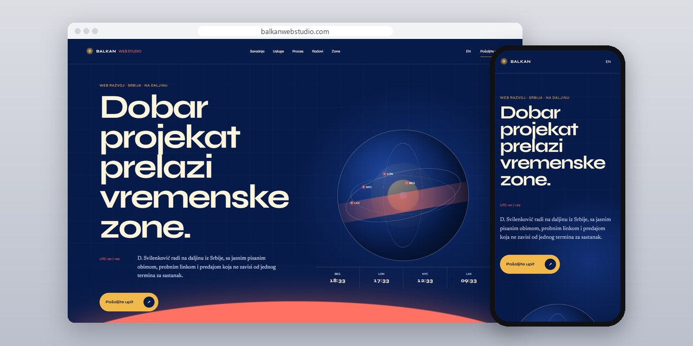
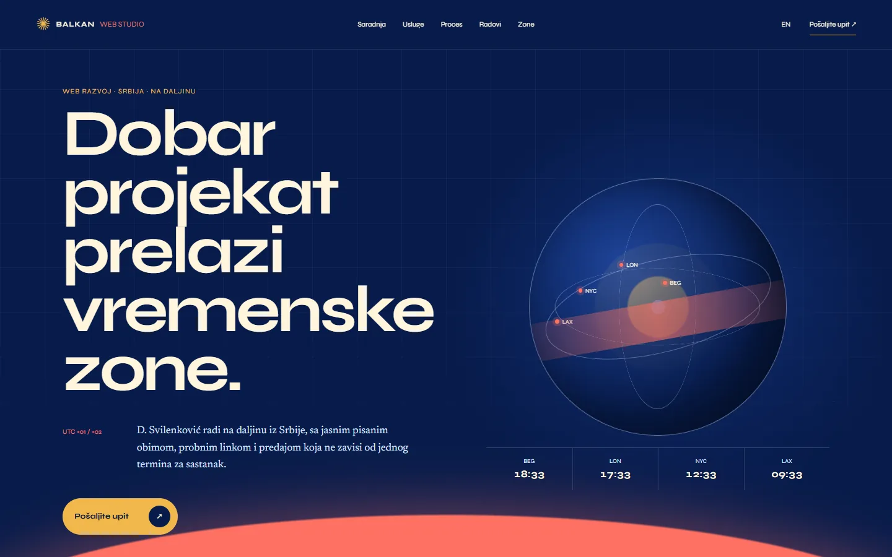
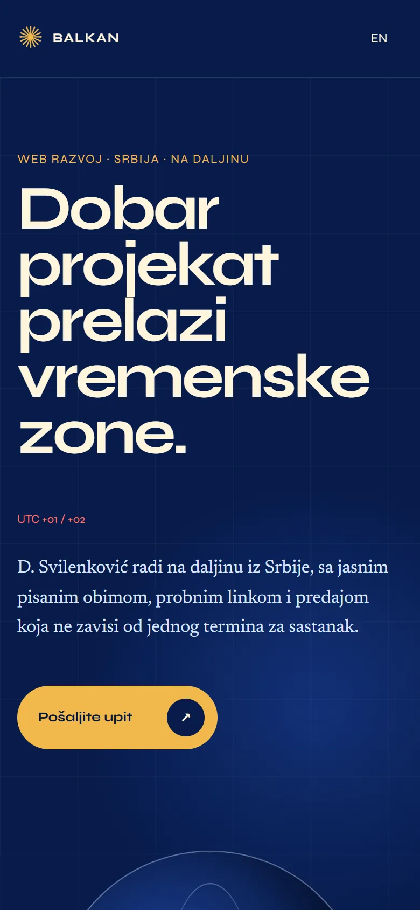

# Balkan Web Studio

A studio site for website projects run across countries and time zones, with a calculator for finding shared working hours.

**[balkanwebstudio.com](https://balkanwebstudio.com/)** · [Case study (in Serbian)](https://svilenkovic.rs/radovi/balkan-web-studio) · [Srpski](README.sr.md)

> [!NOTE]
> My own project, not client work. The source code is private. This page describes what the site does and how it is built.

<table>
  <tr><td><b>Client</b></td><td>Own project</td></tr>
  <tr><td><b>Industry</b></td><td>Web projects across countries and time zones</td></tr>
  <tr><td><b>Location</b></td><td>Serbia</td></tr>
  <tr><td><b>Type</b></td><td>Multi-page website</td></tr>
  <tr><td><b>My role</b></td><td>Research, design, development, SEO and hosting</td></tr>
  <tr><td><b>Stack</b></td><td>Astro 7, TypeScript, PHP 8.3, SQLite, nginx</td></tr>
</table>

## About the project

When people work from several countries, a project agreement cannot assume they share the same clock, language or way of handing work over. Balkan Web Studio describes a process where those things are agreed before the site is built: who decides, in which language, when versions are reviewed and who publishes.

Instead of a generic map, the home page is a solar atlas whose path of light connects different places. The time zone calculator helps people find overlapping working hours without converting by hand; it plans a slot but books nothing and sends no data to anyone. Examples lead to public studies of real projects, such as Prva Lekcija for the Croatian market, and nothing is credited to a local team or office that does not exist.

## What I built

- A time zone calculator for finding overlapping working hours
- A process for written decisions, review windows and staged delivery
- English pages with full Serbian counterparts
- Project examples linked to public case studies, with no invented offices or staff
- Contact and privacy pages written for inquiries from abroad

## Results

| | Performance | Accessibility | Best practices | SEO |
| :-- | :-: | :-: | :-: | :-: |
| Mobile | 100 | 100 | 100 | 100 |
| Desktop | 100 | 100 | 100 | 100 |

PageSpeed Insights, lab test of the live site, October 2026. Security headers: 6 of 6. axe accessibility check: no violations. Structured data: `Organization`, `Person`.

## Screenshots

<table>
  <tr>
    <td width="68%" valign="top"></td>
    <td width="32%" valign="top"></td>
  </tr>
</table>

Time zone calculator on the live site

---

Built by [D. Svilenković](https://svilenkovic.com).
